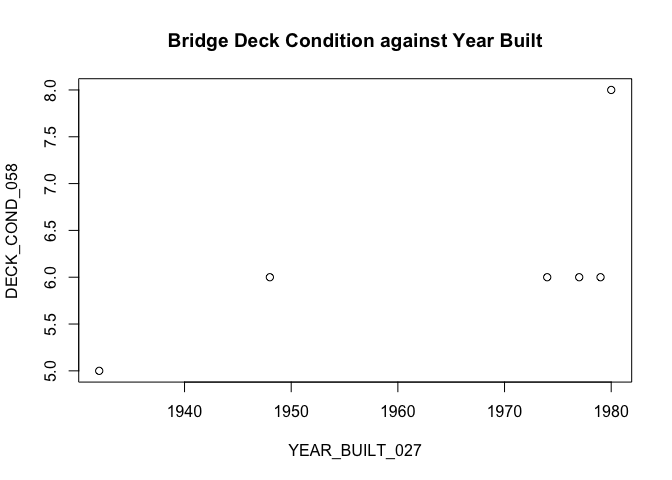

README
================
Xingjian Yan
2/5/2021

``` r
table <- read.table("https://www.fhwa.dot.gov/bridge/nbi/2019/delimited/WI19.txt", quote = "'", sep=",", header = T, dec = ".", fill = T  ) [,c("STATE_CODE_001","STRUCTURE_NUMBER_008","COUNTY_CODE_003","LOCATION_009", "YEAR_BUILT_027", "DECK_COND_058", "SUPERSTRUCTURE_COND_059", "SUBSTRUCTURE_COND_060",    "CHANNEL_COND_061")]
head(table)
```

    ##   STATE_CODE_001 STRUCTURE_NUMBER_008 COUNTY_CODE_003              LOCATION_009
    ## 1             55      00000000000F303              51 6KM NW OF LAC DU FLAMBEAU
    ## 2             55      00000000000F304              51           LAC DU FLAMBEAU
    ## 3             55      00000000000F310             115     10 KM  NE  OF  BOWLER
    ## 4             55      00000000000F311             115     13 KM  NE  OF  BOWLER
    ## 5             55      00000000000F315               3    3 KM  EAST  OF  ODANAH
    ## 6             55      00000000000F317               3      3 KM  NW  OF  ODANAH
    ##   YEAR_BUILT_027 DECK_COND_058 SUPERSTRUCTURE_COND_059 SUBSTRUCTURE_COND_060
    ## 1           1932             4                       5                     5
    ## 2           1974             5                       5                     4
    ## 3           1948             5                       5                     7
    ## 4           1979             5                       7                     8
    ## 5           1977             5                       5                     7
    ## 6           1980             7                       8                     7
    ##   CHANNEL_COND_061
    ## 1                4
    ## 2                7
    ## 3                5
    ## 4                6
    ## 5                4
    ## 6                7

``` r
plot(head(table)[,c("YEAR_BUILT_027","DECK_COND_058")], main = "Bridge Deck Condition against Year Built")
```

<!-- -->

\`\`\`
